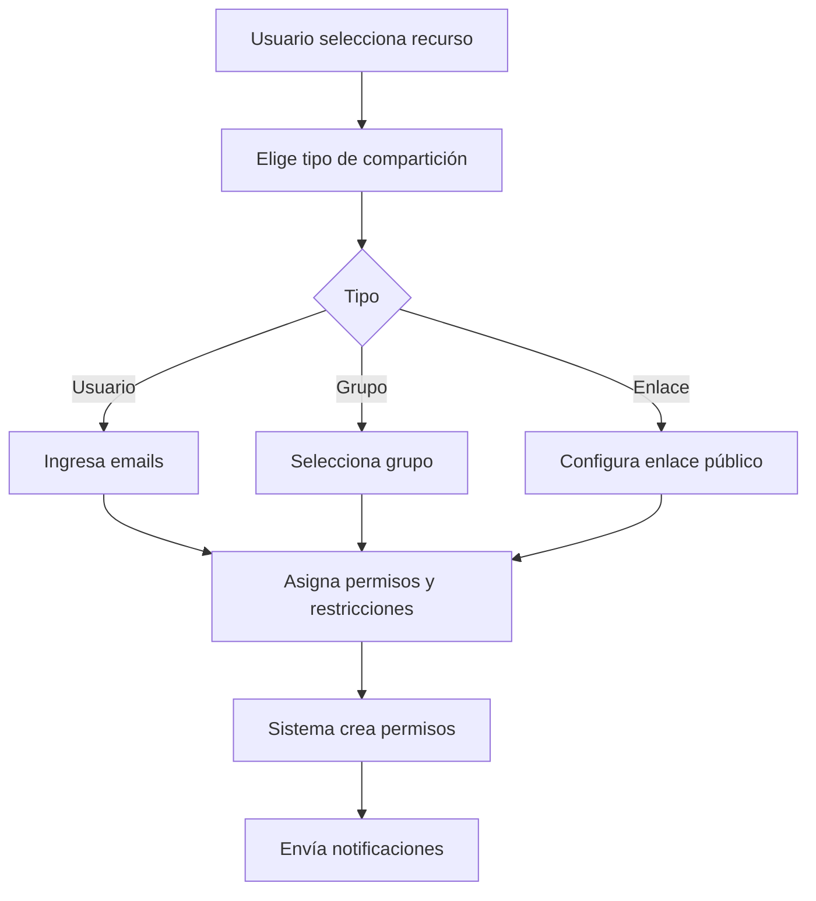
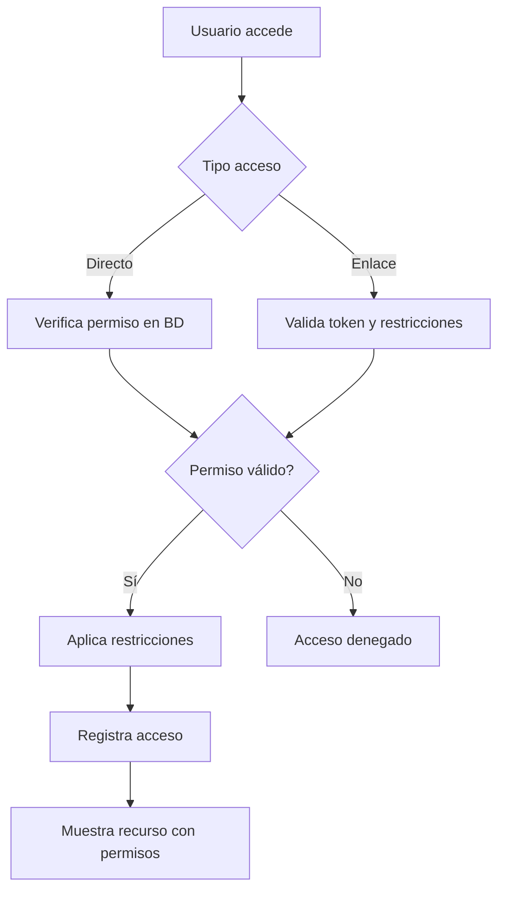

# Sistema de Roles y Compartición Avanzado

## 📋 Resumen del Sistema

Este documento describe el nuevo sistema de roles de dos niveles y compartición avanzada implementado en la Biblioteca Digital.

## 🎯 Estructura de Roles

### **Roles de Sistema (Usuarios)**

#### 1. **Administrador**
- **Código**: `administrador`
- **Descripción**: Control total del sistema
- **Permisos**:
  - ✅ Gestionar usuarios (crear, editar, eliminar)
  - ✅ Ver todos los archivos y carpetas de todos los usuarios
  - ✅ Configurar sistema
  - ✅ Acceso completo a todas las funcionalidades

#### 2. **Usuario Editor**
- **Código**: `usuario_editor`
- **Descripción**: Control de su propio drive
- **Permisos**:
  - ✅ Crear, editar, eliminar sus propios archivos y carpetas
  - ✅ Compartir sus recursos con otros usuarios
  - ❌ No puede ver archivos de otros usuarios (solo los que le compartan)
  - ❌ No puede gestionar usuarios del sistema

### **Roles de Compartición (Para recursos específicos)**

#### 1. **Propietario**
- **Código**: `propietario`
- **Permisos**: Control total del recurso
  - ✅ Ver, editar, eliminar
  - ✅ Comentar
  - ✅ Compartir con otros
  - ✅ Transferir propiedad
  - ✅ Gestionar permisos de otros usuarios
  - ✅ Descargar, imprimir, copiar

#### 2. **Editor**
- **Código**: `editor`
- **Permisos**: Modificar contenido
  - ✅ Ver y editar contenido
  - ✅ Comentar
  - ✅ Descargar, imprimir, copiar
  - ❌ No puede eliminar
  - ❌ No puede gestionar permisos

#### 3. **Comentarista**
- **Código**: `comentarista`
- **Permisos**: Solo comentarios
  - ✅ Ver contenido
  - ✅ Agregar comentarios
  - ✅ Descargar (configurable)
  - ❌ No puede editar
  - ❌ Impresión y copia restringibles

#### 4. **Lector/Visualizador**
- **Código**: `lector`
- **Permisos**: Solo lectura
  - ✅ Ver contenido únicamente
  - ❌ Descarga, impresión y copia restringibles
  - ❌ No puede comentar ni editar

## 🔗 Sistema de Compartición Avanzado

### **1. Compartir con Usuarios Específicos**

```javascript
// Ejemplo de compartición con usuarios
{
  "resource_type": "archivo", // o "carpeta"
  "resource_id": 123,
  "user_emails": ["usuario1@email.com", "usuario2@email.com"],
  "permission": "editor",
  "expiry_date": "2025-12-31",
  "can_download": true,
  "can_print": true,
  "can_copy": false,
  "notify_changes": true,
  "message": "Te comparto este documento para revisión"
}
```

**Características**:
- ✅ Compartir por email o ID de usuario
- ✅ Asignar roles específicos por usuario
- ✅ Mensaje personalizado
- ✅ Notificaciones automáticas

### **2. Compartir con Grupos**

```javascript
// Ejemplo de compartición con grupo
{
  "resource_type": "carpeta",
  "resource_id": 456,
  "group_id": 10,
  "permission": "comentarista",
  "expiry_date": null,
  "can_download": true,
  "notify_changes": false
}
```

**Características**:
- ✅ Todos los miembros del grupo reciben el mismo rol
- ✅ Gestión centralizada de permisos
- ✅ Agregar/quitar miembros actualiza permisos automáticamente

### **3. Compartir con Enlaces Públicos**

```javascript
// Ejemplo de enlace público
{
  "resource_type": "archivo",
  "resource_id": 789,
  "permission": "lector",
  "expiry_date": "2025-06-30",
  "requires_auth": false,
  "password": "secreto123",
  "allowed_domains": "empresa.com,partner.org",
  "can_download": false,
  "can_print": false,
  "notify_access": true
}
```

**Características**:
- ✅ Enlaces públicos o restringidos
- ✅ Protección con contraseña
- ✅ Restricción por dominios
- ✅ Control de descarga/impresión/copia
- ✅ Notificaciones de acceso

### **4. Sistema de Caducidad**

**Tipos de Caducidad**:
- **Fecha específica**: Los permisos expiran en una fecha determinada
- **Sin caducidad**: Permisos permanentes hasta revocación manual
- **Notificaciones**: Alertas antes del vencimiento

**Implementación**:
```sql
-- Los permisos se verifican automáticamente
WHERE (fecha_expiracion IS NULL OR fecha_expiracion > NOW())
```

### **5. Restricciones de Acceso**

**Para Comentaristas y Lectores**:
- **Descarga**: Puede ser deshabilitada
- **Impresión**: Puede ser bloqueada
- **Copia**: Puede ser restringida
- **Vista previa**: Siempre disponible

**Implementación en Frontend**:
```javascript
// Los botones se ocultan según permisos
if (!permission.puede_descargar) {
  downloadButton.style.display = 'none';
}
```

## 🗄️ Estructura de Base de Datos

### **Tablas Principales**

#### `usuarios`
```sql
ALTER TABLE usuarios 
MODIFY COLUMN rol ENUM('administrador','usuario_editor') 
DEFAULT 'usuario_editor';
```

#### `grupos`
```sql
CREATE TABLE grupos (
  id INT PRIMARY KEY AUTO_INCREMENT,
  nombre VARCHAR(255) NOT NULL,
  descripcion TEXT,
  creado_por INT NOT NULL,
  activo TINYINT(1) DEFAULT 1,
  fecha_creacion TIMESTAMP DEFAULT CURRENT_TIMESTAMP
);
```

#### `permisos_archivos` (Actualizada)
```sql
ALTER TABLE permisos_archivos 
ADD COLUMN tipo_comparticion ENUM('usuario','grupo','enlace'),
ADD COLUMN grupo_id INT,
ADD COLUMN puede_descargar TINYINT(1) DEFAULT 1,
ADD COLUMN puede_imprimir TINYINT(1) DEFAULT 1,
ADD COLUMN puede_copiar TINYINT(1) DEFAULT 1,
ADD COLUMN notificar_cambios TINYINT(1) DEFAULT 0;
```

#### `enlaces_compartidos` (Actualizada)
```sql
ALTER TABLE enlaces_compartidos
ADD COLUMN rol_acceso ENUM('propietario','editor','comentarista','lector'),
ADD COLUMN puede_descargar TINYINT(1) DEFAULT 1,
ADD COLUMN requiere_autenticacion TINYINT(1) DEFAULT 0,
ADD COLUMN dominios_permitidos TEXT;
```

## 🔄 Flujo de Compartición

### **1. Usuario Comparte Recurso**


### **2. Usuario Accede a Recurso Compartido**


## 🚀 API Endpoints

### **Compartición con Usuarios**
```http
POST /biblioteca/public/index.php/sharing/share-with-users
Content-Type: application/json

{
  "resource_type": "archivo",
  "resource_id": 123,
  "user_emails": ["user@example.com"],
  "permission": "editor",
  "expiry_date": "2025-12-31",
  "can_download": true,
  "message": "Documento para revisión"
}
```

### **Compartición con Grupos**
```http
POST /biblioteca/public/index.php/sharing/share-with-group
Content-Type: application/json

{
  "resource_type": "carpeta",
  "resource_id": 456,
  "group_id": 10,
  "permission": "comentarista"
}
```

### **Crear Enlace Público**
```http
POST /biblioteca/public/index.php/sharing/create-public-link
Content-Type: application/json

{
  "resource_type": "archivo",
  "resource_id": 789,
  "permission": "lector",
  "password": "secreto123",
  "expiry_date": "2025-06-30",
  "can_download": false
}
```

### **Obtener Permisos**
```http
GET /biblioteca/public/index.php/sharing/permissions?resource_type=archivo&resource_id=123
```

## 🔧 Migración e Instalación

### **1. Ejecutar Migración**
```bash
mysql -u root -p biblioteca_digital < migration_new_roles_system.sql
```

### **2. Actualizar Usuario Admin**
```bash
# Ejecutar script de reparación
http://localhost:8888/biblioteca/fix_admin_login.php
```

### **3. Verificar Sistema**
- ✅ Login con admin@biblioteca.com / admin123
- ✅ Acceder a gestión de usuarios
- ✅ Crear usuarios con nuevos roles
- ✅ Probar compartición de archivos

## 📊 Casos de Uso

### **Caso 1: Administrador**
```
1. Ve todos los archivos del sistema
2. Puede gestionar cualquier recurso
3. Administra usuarios y sus roles
4. Configura el sistema
```

### **Caso 2: Usuario Editor Normal**
```
1. Ve solo sus archivos y los compartidos con él
2. Crea y gestiona sus propios recursos
3. Comparte con otros usuarios según necesidades
4. No puede administrar usuarios
```

### **Caso 3: Compartición Departamental**
```
1. Crear grupo "Marketing"
2. Agregar miembros del departamento
3. Compartir carpeta con el grupo como "Editor"
4. Todos los miembros pueden colaborar
```

### **Caso 4: Compartición Externa**
```
1. Crear enlace público para documento
2. Configurar como "Lector" sin descarga
3. Proteger con contraseña
4. Compartir enlace con cliente externo
```

## 🛡️ Seguridad

### **Validaciones**
- ✅ Verificación de propiedad antes de compartir
- ✅ Validación de roles y permisos
- ✅ Sanitización de inputs
- ✅ Protección CSRF

### **Auditoría**
- ✅ Registro de todos los cambios de permisos
- ✅ Historial de accesos
- ✅ Notificaciones de actividad
- ✅ Logs de seguridad

### **Restricciones**
- ✅ Límites de tiempo en enlaces
- ✅ Restricciones por dominio
- ✅ Control granular de acciones
- ✅ Revocación inmediata de permisos

---

**Versión**: 2.0.0  
**Fecha**: Enero 2025  
**Autor**: Sistema de Biblioteca Digital
